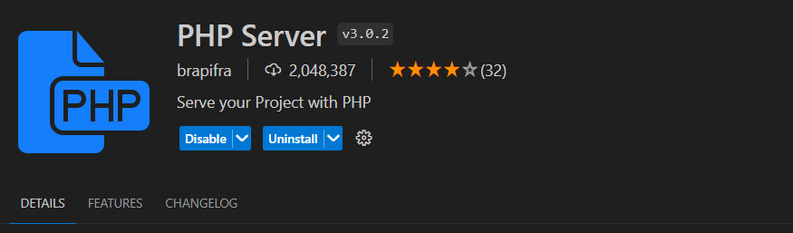
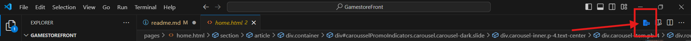

# Gamestore
Ce site est un site vitrine pour la boutique de jeux vidéo : Gamestore

[![Author]](https://github.com/luciletrc)

## Installation

1. Clone the current repository (SSH):
```bash
$ git clone 'git@github.com:Luciletrc/GamestoreFront.git'
```

2. Install dependencies:
```bash
$ npm install
```

3. Install PHP Extension : brapifra.phpserver


## Utilisation

1. Open PHP application


2. Connect to http://localhost:8000/
